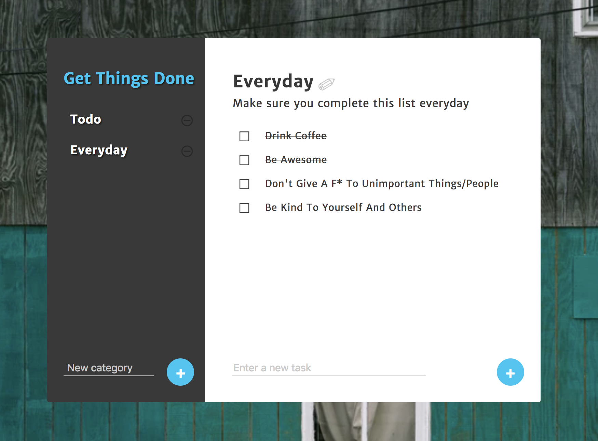

# Get-Things-Done-react :white_check_mark:

Get Things Done is a simple Todo application.  
It offers simple UI with a few intuitive functions to manage todos. 
Your data persists, so feel free to close current tab and come back anytime.

* Click blue `+` button on left side to add a new category.
* Click blue `+` button on right side to add a new todo item.
* Click categories to traverse todos in each category.
* Remove a todo item by clicking a check-box button on the right side of task.
* Check as complete (indicated as line-crossed) by clicking each item.

Click to start using [getThingsDone](http://getThingsDone.surge.sh). 
Thanks for using my app! :heart:
