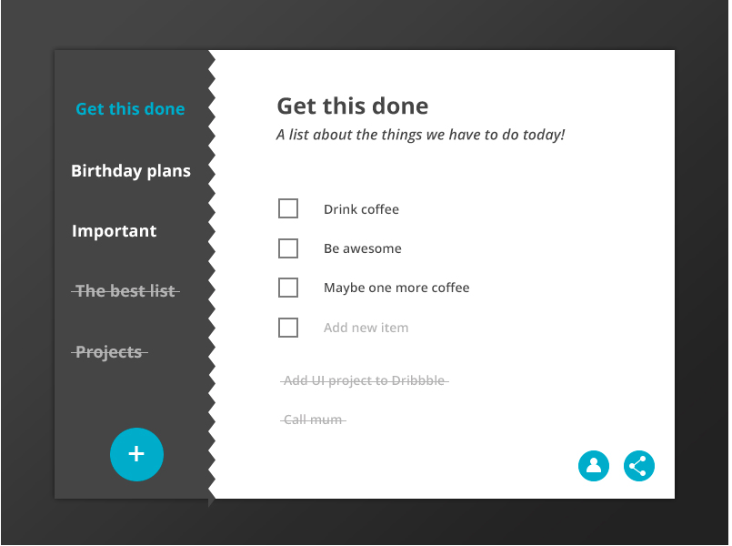

# get-thing-done-react :white_check_mark:

GetThingsDone is a simple Todo application.

GetThingsDone offers simple UI on beautiful background image with several functions to manage a todo list.

#### User can ...

* Add a todo item to each category.
* Create a new category and add todo lists.
* Remove a todo by clicking `Delete` button on the right side of task.
* Check as done by clicking `Complete` button next to delete button.

---

#### Prototype

The project is still in development process. Below is a rough design prototype of the project.

